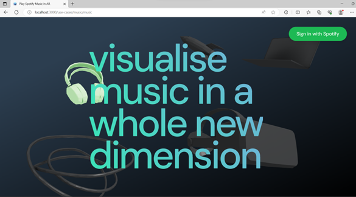
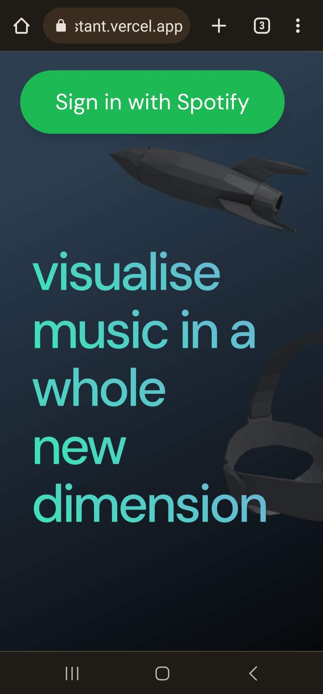
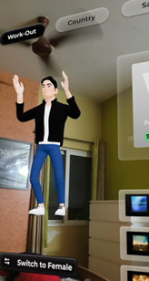
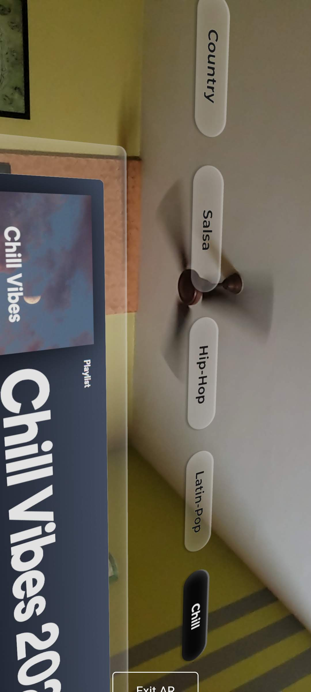
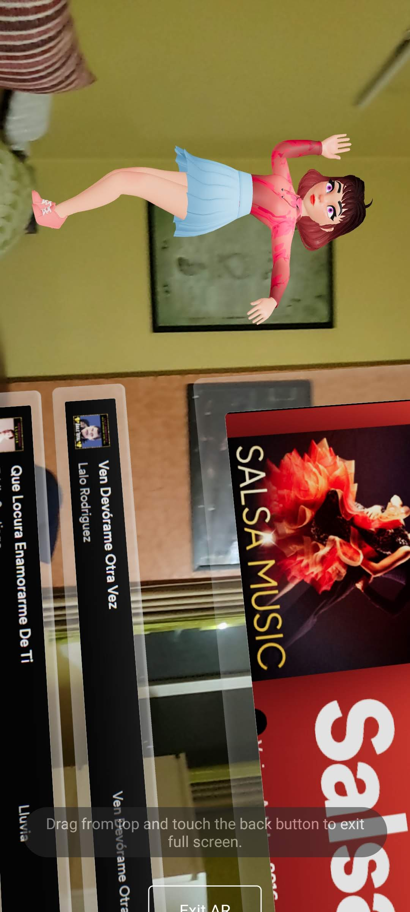

<h1 align="center">AR Personal Assistant - Ossistant</h1>

  
  
  
  

## Table of Contents

 - [Welcome to the AR Personal Assistant](#welcome)
 - [Use cases](#use-cases)
 - [Tech Stack](#techstack)
 - [Contribution](#contribution)
 - [Support](#support)
 - [Contact](#contact)
   

## Welcome to the AR Personal Assistant.
This project aims to make a personal assistant that utilizes Augmented Reality (AR) technology to help users answer their daily queries and perform tasks with a human touch. The AR feature allows users to interact with the assistant in a more immersive and interactive way, making the experience more engaging.

Some of the use cases such assistant can help you with include:

Getting directions or recommendations in a virtual environment
Setting reminders or alarms
Playing music or media, and answering questions
In addition to these everyday tasks, the assistant also has potential for educational and training purposes. Users can learn new skills or information in a virtual augmented environment, making the learning experience more interactive and engaging.

We are excited to see the potential of this AR assistant and hope it can make a positive impact in people's daily lives. Stay tuned for updates and release!

## [Live Link](https://ossistant.vercel.app/)

## Use cases
There are mainly 4 use-cases that we provide as follows,
- [Play Spotify Music in AR](#ar-spotify-music)
- [Virtual Fitness Trainer](#fitness-trainer)
- [Virtual Tour Guide](#tour-guide)
- [Daily Assistant](#daily-assistant)
  

### [Play Spotify Music in AR](https://ossistant.vercel.app/music)

The AR Spotify Music Feature combines the power of Augmented Reality with the vast library of Spotify to take you on captivating musical journeys.

When you access the AR Spotify Music Feature within the app, you'll be greeted with an Augmented Reality experience where you can explore various music genres, playlists, and individual tracks. Each music selection will have its own unique 3D AR assistant accompanying it.

This experience is created with the help of these 4 technologies:
1. Blender
2. React-Three-Fiber
3. WebXR
4. Spotify API

#### Login with a valid Spotify account
  

Note: The AR experience only works on mobile browsers that support AR, not on laptops or PCs.

   

#### Switch between male and female 3D assistant characters in AR

  
  

  #### Take your pick from the different genres available

  

  #### View your favourite songs and albums alongside the animated assistant

  

   

  The currently available music genres are:
  1. Chill
  2. Country
  3. Hip Hop
  4. Latin Pop
  5. Salsa
  6. Workout

  Switch between these genres within the AR experience at your whim, whiile also being able to change yur assistant's configuration to your liking.

### [Virtual Fitness Trainer](https://ossistant.vercel.app/fitnesstrainer)

If you’re a health freak, but don’t get enough time to go out to the gym then we have you covered here with our <b>Virtual Fitness Trainer</b>.
This use case is all about providing a Gym Trainer or Yoga Coach virtually and in a more immersive way for free. 

In this service, users will be provided some workouts and yoga to try out. There are dedicated web pages to perform each workout/yoga. On that page they will get more details about that exercise and 3D Virtual Trainers demonstrating that exercise. These 3D animated trainer models are built using [Blender](https://www.blender.org/) and rendered using [React Three Fiber](https://docs.pmnd.rs/react-three-fiber)

<a href="https://share.vidyard.com/watch/D1RXCkcgWP31KBmAEGjDnS">Demo - Read and Experience 3D</a>

Next, users can actually perform the exercise in front of camera on this platform and the performance will be tracked by our AI-based Body-tracking system built using [Tensorflow](https://www.tensorflow.org/lite/examples/pose_estimation/overview) and [Mediapipe](https://mediapipe-studio.webapps.google.com/home). It will keep a track of performed reps or pose time and let the user know via voice making it a hands-free experience.

<a href="https://share.vidyard.com/watch/xaYAyy4ndBWiNhvJiU5KbG">Demo - Track your session</a>

Last but not least, users can observe the Virtual Fitness Trainer in their own environment by entering the AR mode on their phones. This will actually help users visualize a particular exercise better and understand the best way to do it. This AR experience is also built using [React Three Fiber](https://docs.pmnd.rs/react-three-fiber).

<a href="https://share.vidyard.com/watch/qLWzQzP5h4arA5Aqnrgho2">Demo - Get Immersed in AR</a>

### [Virtual Tour Guide](https://ossistant.vercel.app/tourguide)

### [Assistance on Daily Queries](https://ossistant.vercel.app/chat)

<a name="techstack"><a/>
## Tech Stack
- <a href="https://nextjs.org/">Next.js</a>
- <a href="https://docs.pmnd.rs/react-three-fiber">React Three Fiber</a>
- <a href="https://mediapipe-studio.webapps.google.com">Mediapipe</a>
- <a href="https://www.tensorflow.org/lite/examples/pose_estimation/overview">Tensorflow</a>
- <a href="https://platform.openai.com/docs/api-reference">OpenAI API</a>
- <a href="https://developer.spotify.com/documentation/web-api">Spotify API</a>

<a name="contribution"><a/>
## Contribution

All credits goes to these people

 
 
Want to help contribute to the development of this project? We welcome any contributions, bug reports, and feedback. Please feel free to open an issue or submit a pull request.

For more information, checkout [Notion Page](https://osenorth.notion.site/AR-Personal-Assistant-2c09623734294109b375d6157b5a549c)

<a name="support"><a/>
## Support
For any support or help with the installation please open an issue in the Github Repository

<a name="contact"><a/>
## Contact
Reach us at hi@osenorth.co for any other queries.

